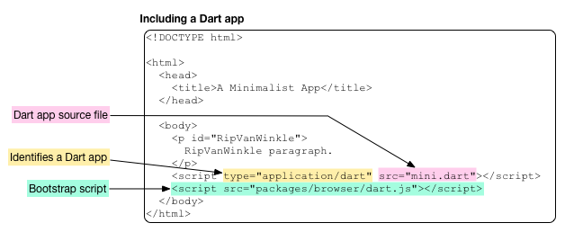
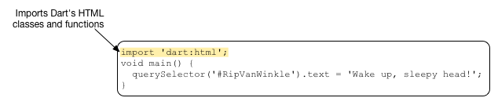

  

The first script includes your mini app. The `type` attribute specifies that the script has the type `application/dart`, which is a new type created by the Dart team. Currently, only the Dartium build of Chromium supports `application/dart`. The `src` attribute provides the URL to the source file of the script. In this case, it is the Dart source file `mini.dart`, which you provide in the next step. The Dart file should be in the same directory as its host HTML file.

The second `script` tag is a bootstrap script that takes care of turning on the Dart VM, as well as compatibility with non-Dart browsers.  

## About the Dart source code  

Let’s step through the code. 

### Importing libraries  

The import directive imports the specified library, making all of the classes and functions in that library available to your program.  

 

This program imports Dart’s HTML library, which contains key classes and functions for programming the DOM. Key classes include:  

```Dart class   Description
    [Node](https://api.dartlang.org/dart_html/Node.html)        Implements a Dart Node.
    [Element](https://api.dartlang.org/dart_html/Element.html)    A subclass of Node, implements a web page element.
    [Document](https://api.dartlang.org/dart_html/Document.html)    Another subclass of Node. Implements the document object.```  

The Dart core library contains another useful class, [List](https://api.dartlang.org/dart_core/List.html), a parameterized class that can specify the type of its members. An instance of Element keeps its list of child Elements in a List<Element>.  
### Using the querySelector() function  

This app’s main() function contains a single line of code that is a little like a run-on sentence with multiple things happening one after another. Let’s deconstruct it.

querySelector() is a top-level function provided by the Dart HTML library that gets an Element object from the DOM.  

  

The argument to querySelector(), a string, is a CSS selector that identifies the object. Most commonly CSS selectors specify classes, identifiers, or attributes. We’ll look at these in a little more detail later, when we add a CSS file to the mini app. In this case RipVanWinkle is the unique ID for a paragraph element declared in the HTML file and #RipVanWinkle specifies that ID.  

Another useful function for getting elements from the DOM is querySelectorAll(), which returns multiple Element objects via a list of elements—List—all of which match the provided selector.

