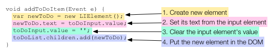

#  Add Elements to the DOM  
### Dynamically add items to the browser page.  
[Tutorials link](https://www.dartlang.org/docs/tutorials/add-elements/)

## Getting an element from the DOM  

The following diagram shows the Dart code for the todo app.  

  

The `main()` function uses dart:html’s top-level `querySelector()` function to get the interesting elements from the DOM. Because calling `querySelector()` isn’t free, if a program refers to an element more than once it should stash a reference to the element.

This program stashes a reference to the input element in a top-level variable called `toDoInput`. The unordered list is in the top-level variable `toDoList`.

Note the types of these variables: `InputElement` and `UListElement`. These are both subclasses of `Element`. The `dart:html` library has dozens of Element subclasses, many of which correspond to certain HTML tags. This program uses three:  
HTML tag    Dart class
<input> [InputElement](https://api.dartlang.org/dart_html/InputElement.html)
<ul>    [UListElement](https://api.dartlang.org/dart_html/UListElement.html)
<li>    [LIElement](https://api.dartlang.org/dart_html/LIElement.html)  

## Registering an event handler  

When a user enters text into the input field, a change event fires, indicating that the value in the input field has just changed. The todo app defines a function, `addToDoItem()`, that can handle these change events. The following code connects `addToDoItem()` to the input field:  
  

Rather than dissect this busy line of code, think of it as a Dart idiom for adding an event handler to an Element.  

  

A change event is just one of many different types of events that an input element can generate. For example, you can use `click` to handle mouse clicks, or `keyDown` for when the user presses a key on the keyboard.  

## About EventListener functions  

The argument passed to the listen() method is a callback function of type [EventListener](https://api.dartlang.org/dart_html/EventListener.html). `EventListener` is a typedef defined in the `dart:html` library as follows:  
    typedef void EventListener(Event event)  

As you can see, an EventListener returns no value (void) and takes an [Event](https://api.dartlang.org/dart_html/Event.html) object as an argument. Any function with this signature is an EventListener. Based on its signature, the `addToDoItem()` function is an EventListener.  

    void addToDoItem(Event e) { ... }  
The Event object passed into an EventListener function carries information about the Event that occurred. For example, the Event object knows which Element fired the event, and when. For location-specific events such as mouse clicks, the Event object also knows where the event occurred.  

The `addToDoItem()` function ignores the Event object passed to it.  

## Adding an element to the DOM tree  

The change event handler has the following code:  

  

The final line of code is where the DOM gets changed.  

An Element keeps references to all of its children in a list called `children`. By adding and removing elements to and from this list, the code changes the DOM. When the DOM changes, the browser re-renders the browser page. The effect, in our todo app, is that a new bullet item appears in the to do list.  

