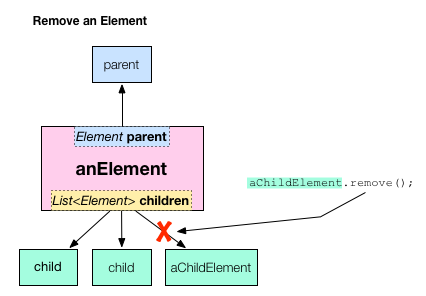
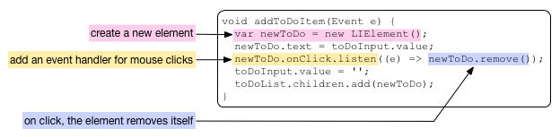
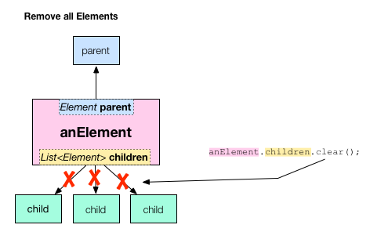

# Remove DOM Elements  
### Dynamically delete items from the browser page.  

[turorials link](https://www.dartlang.org/docs/tutorials/remove-elements/)  

## Removing an element from the DOM tree  

An element is removed from the DOM when it is removed from its parent’s list of children. The [List](https://api.dartlang.org/dart_core/List.html) class provides functions for finding an item in the list and removing it. But, in this case, using the element’s remove() function is shorter and more concise than using functions from the List class.  

  

In the todo_with_delete app, the user clicks an item to delete it. This is achieved with one line of Dart code. When a new to do item is created, the code registers a mouse click handler on the new element. When the user clicks that new element, its event handler causes the element to remove itself from the DOM with `remove()`.  

When the element removes itself from the DOM, the browser re-renders the page, and the item disappears from the to do list.  

## Removing all child elements from an element  

When the user clicks the **Delete All** button, all elements are removed from the list.  

  

In this case, using the List class’s `clear()` function yields the most concise code. Here’s the code from the todo_with_delete app that implements the Delete All button.  

1. The HTML code creates a button with the ID delete-all. (The CSS styles it.)  
    <button id="delete-all" type="button" style="float:right"> Delete All </button>  
2. The Dart code gets the button element from the DOM using querySelector() and the button’s ID, #delete-all. The code registers a mouse click handler on the button; the handler removes all of the child elements from the to do list. Here is all of the Dart code related to the **Delete All** button.  

  

## About function expressions and =>  

The todo_with_delete app uses some interesting Dart syntax when adding an event listener to the **Delete All** button. The argument passed into the listen() function is an example of a function expression, which is a shorthand way of defining functions and it uses the => syntax to define the function concisely.  

  

It is equivalent to writing this:  

    deleteAll.onClick.listen((e) {
    toDoList.children.clear();
    });  

or even this:  
    ...
    void main() {
      ...
      deleteAll.onClick.listen(deleteAllElements);
    }

    void deleteAllElements(Event e) {
      toDoList.children.clear();
    }
    ...  

Function expressions are often used when registering event handlers on an element and can extend over multiple lines. When registering event handlers, the function must be an EventListener. That is, it returns no value and takes an Event object as a parameter.  

